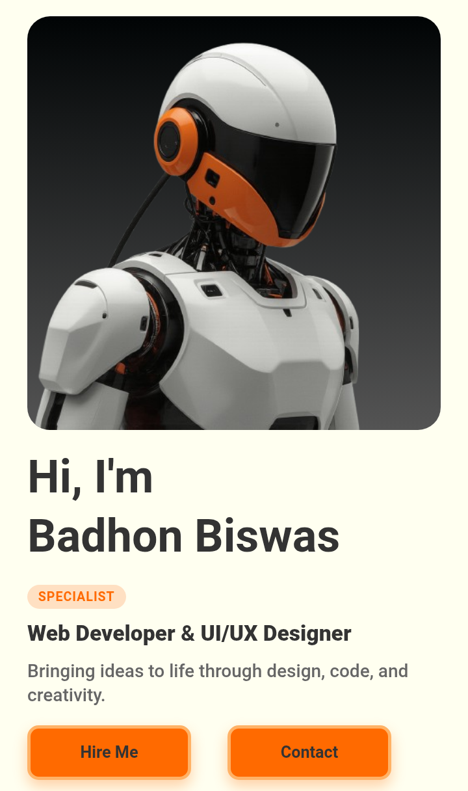

<!-- Logo -->
<p align="center">
  
</p>

<h1 align="center">TheBadhon</h1>

<p align="center">
  A modern, minimal, and clean portfolio website built with <strong>Astro</strong>.
  <br>
  Designed and developed by <a href="https://github.com/thebadhonbiswas" target="_blank">Badhon Biswas</a>.
</p>

<div align="center">
  
  
  
  
  <a href="https://github.com/thebadhonbiswas">
    
  </a>
</div>

---

## 🚀 Features

- 🌐 Built with [Astro](https://astro.build)
- 🎨 Clean and modern UI
- ⚡ Optimized performance
- 📱 Fully responsive design
- 💻 Developer-friendly structure

---

## 📸 Preview

  


---

## 📂 Project Structure

```bash
/
├── public/              # Static assets (logo, images)
├── src/
│   ├── components/      # Reusable UI components
│   ├── layouts/         # Layout templates
│   ├── pages/           # Site pages (Home, About, etc.)
│   └── styles/          # Global and component styles
├── astro.config.mjs     # Astro config
└── package.json         # Project metadata and scripts


---

🛠️ Installation

# Clone the repo
git clone https://github.com/thebadhonbiswas/TheBadhon.git

# Navigate to project directory
cd TheBadhon

# Install dependencies
npm install

# Start the dev server
npm run dev


---

🔗 Live Site

👉 https://thebadhon.vercel.app
(Replace with actual link if different)


---

🙋‍♂️ About Me

I'm Badhon Biswas, a passionate student and developer who loves building beautiful web experiences.

Portfolio: badhonbiswas.vercel.app

YouTube: @thebadhonbiswas

Telegram: @thebadhonbiswas

Instagram: @thebadhonbiswas


---

📄 License

This project is open-source and available under the MIT License.


---

> Made with ❤️ by Badhon Biswas


©2025 All right reserved